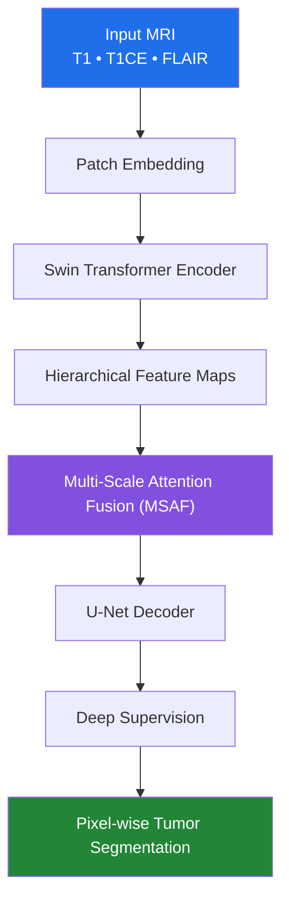

<div align="center">

# 🧠 Brain Tumor Segmentation using SwinUNet with Multi-Scale Attention Fusion (MSAF)

### Transformer-Based Multi-Modal Brain MRI Segmentation for Accurate Tumor Delineation

**A research-driven deep learning framework leveraging hierarchical vision transformers, attention-guided feature fusion, and deep supervision for robust brain tumor segmentation across BraTS datasets.**

[](https://www.python.org/)
[](https://pytorch.org/)
[](https://nipy.org/nibabel/)
[](https://opencv.org/)
[](#)
[](#-license)
[](https://github.com/manas-08/brainTumorSegmentation_Using_Transformers_And_XAITechniques/stargazers)

### 🚀 Swin Transformer Encoder × Multi-Scale Attention Fusion × U-Net Decoder × Deep Supervision

*Designed for high-precision semantic segmentation of brain tumors from multi-modal MRI scans.*

</div>

---

# 📖 Table of Contents

- [Overview](#-project-overview)
- [Key Features](#-key-features)
- [Dataset](#-dataset)
- [Model Architecture](#️-model-architecture)
- [Installation](#️-installation)
- [Training](#-training)
- [Evaluation](#-evaluation)
- [Inference](#-inference)
- [Results](#-results)
- [Pretrained Models](#-pretrained-models)
- [Technologies Used](#️-technologies-used)
- [Future Improvements](#-future-improvements)
- [Citation](#-citation)
- [Contributors](#-contributors)
- [Acknowledgements](#-acknowledgements)
- [License](#-license)

---

# 📌 Project Overview

Brain tumor segmentation is one of the most challenging tasks in medical image analysis due to the highly irregular shapes, varying tumor sizes, blurred boundaries, and significant intensity variations across MRI modalities.

Traditional convolution-based architectures often struggle to simultaneously capture **global contextual information** and **fine spatial details**, leading to inaccurate segmentation around complex tumor boundaries.

This project introduces a **Transformer-powered semantic segmentation framework** that combines the strengths of hierarchical Vision Transformers with the localization capabilities of U-Net to achieve robust and precise tumor delineation.

The proposed architecture integrates multiple advanced components into a unified pipeline:

| Component | Purpose |
|------------|---------|
| 🧠 **Swin Transformer Encoder** | Learns rich hierarchical global representations using shifted-window self-attention |
| 🎯 **Multi-Scale Attention Fusion (MSAF)** | Selectively fuses encoder and decoder features through attention-guided skip connections |
| 🔍 **U-Net Decoder** | Progressively reconstructs high-resolution segmentation maps |
| 📈 **Deep Supervision** | Improves optimization by introducing auxiliary supervision at multiple decoder stages |
| 🧩 **Multi-Modal MRI Fusion** | Utilizes complementary anatomical information from T1, T1CE, and FLAIR modalities |

Unlike conventional segmentation pipelines, the proposed framework effectively captures both **long-range contextual dependencies** and **fine-grained structural information**, making it well suited for challenging brain tumor segmentation scenarios.

---

# ✨ Key Features

- ✅ Transformer-based encoder using Swin Transformer
- ✅ Multi-Scale Attention Fusion (MSAF) for enhanced skip connections
- ✅ U-Net style decoder for precise localization
- ✅ Deep supervision for improved convergence
- ✅ Multi-modal MRI processing (T1 + T1CE + FLAIR)
- ✅ Hierarchical feature extraction
- ✅ End-to-end semantic segmentation pipeline
- ✅ Optimized for BraTS datasets
- ✅ Modular architecture for future experimentation
- ✅ Easily extendable to other medical segmentation tasks

---

# 📂 Dataset

The model has been trained and evaluated on the internationally recognized **BraTS Challenge** datasets:

- ✅ BraTS 2018
- ✅ BraTS 2019
- ✅ BraTS 2020

### MRI Modalities Used

| Modality | Purpose |
|-----------|----------|
| **T1** | Anatomical brain structure |
| **T1CE** | Contrast-enhanced tumor regions |
| **FLAIR** | Edema and lesion visualization |

> **Note:** T2-weighted MRI was intentionally excluded because FLAIR already captures edema-related information more effectively while reducing redundancy across modalities.

---

# 🏗️ Model Architecture



### Core Architectural Highlights

- Hierarchical Swin Transformer encoder
- Shifted Window Multi-Head Self Attention
- Multi-Scale Attention Fusion (MSAF)
- Rich attention-enhanced skip connections
- Progressive U-Net decoder
- Multi-level deep supervision
- High-resolution segmentation reconstruction
- End-to-end trainable architecture

---

# ⚙️ Installation

Clone the repository

```bash
git clone https://github.com/<your-username>/<repo-name>.git
```

Navigate into the project

```bash
cd <repo-name>
```

Install dependencies

```bash
pip install -r requirements.txt
```
---

# 📊 Results

The proposed SwinUNet + Multi-Scale Attention Fusion (MSAF) framework was evaluated on the BraTS benchmark datasets using standard semantic segmentation metrics.

## Segmentation Performance

| Class | Dice Score ↑ | IoU ↑ | Sensitivity ↑ | Specificity ↑ | HD95 ↓ |
|:------|-------------:|------:|--------------:|--------------:|--------:|
| Flair | **0.9983** | **0.9964** | **0.996** | **0.981** | **0.9375** |
| T1CE | **0.9572** | **0.8489** | **0.945** | **0.998** | **1.5752** |
| T1 | **0.9080** | **0.7332** | **0.913** | **0.997** | **1.6758** |

### Dataset-wise Validation Accuracy

| Dataset | Validation Accuracy |
|---------|--------------------:|
| BraTS 2018 | **97.4%** |
| BraTS 2019 | **97.3%** |
| BraTS 2020 | **97.7%** |

### Qualitative Results

The proposed architecture demonstrates strong segmentation performance across multiple MRI modalities, accurately identifying tumor boundaries while preserving intricate anatomical structures. The integration of Multi-Scale Attention Fusion significantly enhances feature propagation between the encoder and decoder, leading to improved localization and segmentation consistency.

---

# 📥 Pretrained Models

Due to GitHub file size limitations, pretrained weights are hosted separately.

## Download Here

### 📦 https://drive.google.com/drive/folders/1MsOAdyEuEysX0R2HvNrADfVr4l-KsEEG

Included:

- Best-performing model
- SwinUNet checkpoints
- MSAF variants
- Experimental models
- Training outputs
- Validation checkpoints

Place downloaded weights inside

```
checkpoints/
```

before running evaluation or inference.

---

# 🛠️ Technologies Used

| Category | Technologies |
|------------|-------------|
| Programming | Python |
| Deep Learning | PyTorch |
| Medical Imaging | NiBabel |
| Computer Vision | OpenCV |
| Numerical Computing | NumPy |
| Experimentation | Google Colab |
| Model | Swin Transformer |
| Segmentation | U-Net |
| Attention | Multi-Scale Attention Fusion |
| Dataset | BraTS 2018–2020 |

---

# 🚀 Future Improvements

Some promising directions for future work include:

- Incorporating all four MRI modalities including T2
- 3D volumetric segmentation
- Cross-attention based feature fusion
- Lightweight deployment models
- Clinical decision support integration
- Explainability using Grad-CAM
- Real-time inference optimization
- MONAI integration
- Hybrid CNN-Transformer architectures

---

# 📚 Citation

If this project contributes to your research, please consider citing it.

```bibtex
@misc{BrainTumorMSAF2026,
  title={Brain Tumor Segmentation using SwinUNet with Multi-Scale Attention Fusion},
  author={
    Manas Shende and
    Aarsh Hadap and
    Aryan Sharma and
    Aniruddha Kide
  },
  year={2026},
  publisher={GitHub},
  howpublished={\url{https://github.com/<your-username>/<repo-name>}}
}
```

---

# 🤝 Contributors

## Project Team

- **Aarsh Hadap**
- **Aniruddha Kide**
- **Aryan Sharma**
- **Manas Shende**

---

## Academic Guide

**Dr. Amit Pimpalkar**

Department of Artificial Intelligence & Cyber Security

Shri Ramdeobaba College of Engineering and Management, Nagpur

---

Contributions, discussions, suggestions, and improvements are always welcome.

Feel free to open an issue or submit a pull request.

---

# 🙏 Acknowledgements

We gratefully acknowledge:

- **BraTS Challenge** organizers for providing benchmark datasets.
- The developers of **Swin Transformer** for introducing hierarchical Vision Transformers.
- The creators of the **U-Net** architecture, which remains one of the most influential models in medical image segmentation.
- The **PyTorch** community for providing an excellent deep learning framework.
- Open-source contributors whose libraries and tools made this project possible.

---

# 📄 License

This repository is intended for **research and educational purposes only**.

Please ensure compliance with the licensing terms of the **BraTS Challenge Dataset** before using the dataset for academic or commercial applications.

---

<div align="center">

## ⭐ Support the Project

If you found this repository useful, please consider giving it a **⭐ Star**.

It helps support future development and encourages further research in AI for medical imaging.

**Happy Coding! 🚀**

</div>
