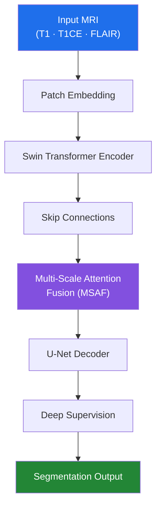

<div align="center">

# 🧠 Brain Tumor Segmentation with SwinUNet + Multi-Scale Attention Fusion (MSAF)

**A transformer-powered segmentation framework for multi-modal brain MRI, built on BraTS 2018–2020**

[](https://www.python.org/)
[](https://pytorch.org/)
[](https://nipy.org/nibabel/)
[](#-license)
[](https://github.com/your-username/repo-name/stargazers)

*Swin Transformer encoder × U-Net decoder × attention-fused skip connections × deep supervision*

</div>

---

## 📖 Table of Contents

- [Overview](#-project-overview)
- [Dataset](#-dataset)
- [Architecture](#️-model-architecture)
- [Repository Structure](#-repository-structure)
- [Installation](#️-installation)
- [Training](#-training)
- [Evaluation](#-evaluation)
- [Results](#-results)
- [Pretrained Models](#-pretrained-models)
- [Inference](#-inference)
- [Tech Stack](#️-technologies-used)
- [Citation](#-citation)
- [Contributors](#-contributors)
- [License](#-license)
- [Acknowledgements](#-acknowledgements)

---

## 📌 Project Overview

Brain tumor segmentation is central to diagnosis, treatment planning, and disease monitoring — but conventional CNNs often struggle to balance **long-range contextual understanding** with **fine-grained spatial precision**.

This project proposes a **SwinUNet-based segmentation framework** that combines:

| Component | Role |
|---|---|
| 🔹 **Swin Transformer Encoder** | Hierarchical, shifted-window self-attention for global context |
| 🔹 **U-Net Decoder** | Precise spatial reconstruction of tumor boundaries |
| 🔹 **Multi-Scale Attention Fusion (MSAF)** | Attention-guided fusion at every skip connection |
| 🔹 **Deep Supervision** | Auxiliary losses at multiple decoder depths for sharper convergence |

The framework consumes **multi-modal MRI (T1, T1CE, FLAIR)** and produces pixel-wise tumor segmentation maps.

---

## 📂 Dataset

Trained and validated on the **BraTS Challenge** datasets:

- BraTS 2018
- BraTS 2019
- BraTS 2020

**Modalities used:** T1-weighted · T1 Contrast-Enhanced (T1CE) · FLAIR

> ℹ️ T2-weighted images were excluded — redundant with FLAIR and inconsistent in quality across samples.

---

## 🏗️ Model Architecture



**Key features**

- Swin Transformer encoder with shifted-window multi-head self-attention
- Hierarchical, multi-scale feature extraction
- MSAF-enhanced skip connections for richer decoder input
- U-Net decoder with progressive upsampling
- Deep supervision at multiple decoder stages
- Native multi-modal MRI input (T1 + T1CE + FLAIR)

---

## 📁 Repository Structure

```
.
├── configs/              # Training / model configuration files
├── src/
│   ├── train.py          # Training entry point
│   ├── test.py           # Evaluation script
│   ├── inference.py      # Inference on new scans
│   ├── models/           # SwinUNet + MSAF architecture
│   ├── data/             # Dataset loaders & preprocessing
│   └── utils/            # Metrics, logging, helpers
├── checkpoints/           # Pretrained weights (downloaded, see below)
├── results/               # Quantitative & qualitative outputs
├── requirements.txt
└── README.md
```

---

## ⚙️ Installation

```bash
git clone https://github.com/<your-username>/<repo-name>.git
cd <repo-name>
pip install -r requirements.txt
```

---

## 🚀 Training

```bash
python src/train.py
```

Training parameters (learning rate, batch size, modalities, augmentation, etc.) are set via the config files in `configs/`.

---

## 🔍 Evaluation

```bash
python src/test.py
```

---

## 📊 Results

Evaluated with standard medical segmentation metrics:

| Metric | Value |
|---|---|
| Dice Score | _add result_ |
| IoU | _add result_ |
| Precision | _add result_ |
| Recall | _add result_ |
| Accuracy | _add result_ |

> 📁 Full quantitative comparisons and qualitative segmentation overlays are in [`results/`](./results).

<p align="center">
  <em>Add sample segmentation overlays here, e.g.</em><br>
  <code>&lt;img src="results/sample_overlay.png" width="700"&gt;</code>
</p>

---

## 📥 Pretrained Models

Model weights aren't included in this repo (GitHub file-size limits). Download from Google Drive:

**➡️ [Pretrained Checkpoints](https://drive.google.com/drive/folders/1MsOAdyEuEysX0R2HvNrADfVr4l-KsEEG)**

Includes:
- Trained SwinUNet models
- MSAF-enhanced checkpoints
- Experimental variants
- Best-performing weights
- Additional training outputs

Place the downloaded checkpoint(s) in `checkpoints/` before running evaluation or inference.

---

## 💻 Inference

```bash
python src/inference.py --weights checkpoints/best_model.pth
```

---

## 🛠️ Technologies Used


Also built on **Swin Transformer** and **U-Net** architectures.

---

## 📚 Citation

If this work helps your research, please cite:

```bibtex
@misc{braintumor_swinunet,
  title  = {Brain Tumor Segmentation using SwinUNet with Multi-Scale Attention Fusion},
  author = {Shende, Manas and Contributors},
  year   = {2026},
  publisher = {GitHub},
  howpublished = {\url{https://github.com/<your-username>/<repo-name>}}
}
```

---

## 🤝 Contributors

- **Manas Shende**
- **Team Members**

Contributions are welcome — open an issue or submit a pull request.

---

## 📄 License

This project is intended for **research and educational purposes**.
Please review the [BraTS dataset license](https://www.med.upenn.edu/cbica/brats/) terms before use.

---

## ⭐ Acknowledgements

Built on the **BraTS (Brain Tumor Segmentation)** challenge datasets, and on the **Swin Transformer** and **U-Net** architectures for medical image segmentation.

<div align="center">

If this repo helped you, consider giving it a ⭐

</div>
